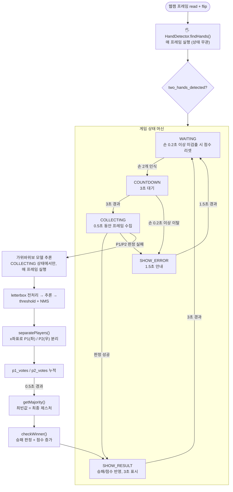

# 가위바위보 게임 코드 흐름도

- Mermaid 문법으로 작성된 다이어그램입니다.
- VS Code(Mermaid 확장), GitHub, Mermaid Live Editor(https://mermaid.live) 등에서
  아래 코드 블록을 열거나 붙여넣으면 바로 시각화되며, 텍스트 편집기로 자유롭게 수정할 수 있습니다.

```mermaid
flowchart TD
    Start(["웹캠 프레임 read + flip"]) --> HD["🖐️ HandDetector.findHands()
매 프레임 실행 (상태 무관)"]
    HD --> Flag{"two_hands_detected?"}

    Flag --> SM

    subgraph SM["게임 상태 머신"]
        direction TB
        W["WAITING
손 0.2초 이상 미검출 시 점수 리셋"]
        CD["COUNTDOWN
3초 대기"]
        COL["COLLECTING
0.5초 동안 프레임 수집"]
        RES["SHOW_RESULT
승패/점수 반영, 3초 표시"]
        ERR["SHOW_ERROR
1.5초 안내"]

        W -->|"손 2개 인식"| CD
        CD -->|"3초 경과"| COL
        CD -->|"손 0.2초 이상 이탈"| ERR
        COL -->|"판정 성공"| RES
        COL -->|"P1/P2 판정 실패"| ERR
        RES -->|"3초 경과"| W
        ERR -->|"1.5초 경과"| W
    end

    COL --> TFL[" 가위바위보 모델 추론
COLLECTING 상태에서만, 매 프레임 실행"]
    TFL --> Pre["letterbox 전처리 → 추론 →
threshold + NMS"]
    Pre --> Sep["separatePlayers()
x좌표로 P1(좌) / P2(우) 분리"]
    Sep --> Vote["p1_votes / p2_votes 누적"]
    Vote -->|"0.5초 경과"| Maj["getMajority()
최빈값 = 최종 제스처"]
    Maj --> Win["checkWinner()
승패 판정 + 점수 증가"]
    Win --> RES
```
